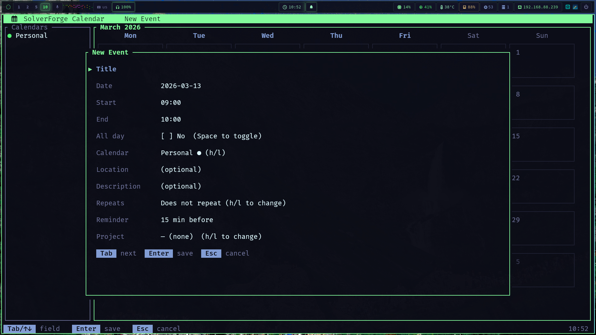

# SolverForge Calendar

<div align="center">

  

  <br />

  [](https://github.com/blackopsrepl/solverforge-calendar/actions/workflows/ci.yml)
  [](https://github.com/blackopsrepl/solverforge-calendar)
  [](https://www.rust-lang.org)
  [](https://ratatui.rs/)

</div>

A spiffy ratatui TUI calendar — local SQLite with Google Calendar sync and DAG-linked events.



## Quick Start

```bash
# Build both binaries
cargo build --release
./target/release/solverforge-calendar

# Human-facing TUI entrypoint
cargo run

# Agent-facing CLI entrypoint
cargo run --bin solverforge-calendar-cli -- calendars list

# Or use the repo Makefile
make build
make test
```

## Features

- **Multiple views** - Month, week, day, and agenda views with vim-style navigation
- **Google Calendar sync** - Incremental two-way sync with OAuth (tokens in OS keyring)
- **Event dependencies** - DAG-linked events with cycle detection and topological ordering
- **Recurring events** - Full RFC 5545 RRULE support (daily, weekly, monthly, custom)
- **Non-blocking I/O** - Background workers for all DB and API operations
- **Local SQLite database** - Events, calendars, projects stored in `~/.local/share/solverforge/calendar.db`
- **iCal import/export** - Standard `.ics` support
- **Desktop notifications** - Reminder alerts via libnotify
- **Pure CLI companion** - JSON-first CRUD and Google sync for agents and automation
- **SolverForge theme** - Reads hackerman palette from `colors.toml`

## Keybindings

### Global
- `Ctrl+c` / `q` - Quit
- `1` - Month view
- `2` - Week view
- `3` - Day view
- `4` - Agenda view
- `?` - Help
- `G` / `S` - Google Calendar sync

### Navigation
- `h`/`j`/`k`/`l` - Move left/down/up/right
- `H`/`L` - Previous/next month
- `Tab` - Toggle sidebar focus
- `Space` - Toggle calendar visibility

### Events
- `c` - Create event
- `e` - Edit selected event
- `d` - Delete selected event
- `Enter` - Open event details

### Quick Add
- `a` - Quick add event (command-line style)

## CLI Automation

`solverforge-calendar-cli` is a non-interactive companion binary for agents and scripts. Successful commands write JSON to stdout, failures write JSON to stderr, and destructive actions require explicit flags rather than prompts.

```bash
# Stable wrapper for agents
./scripts/solverforge-calendar-cli calendars list

# Calendars
cargo run --bin solverforge-calendar-cli -- calendars list
cargo run --bin solverforge-calendar-cli -- calendars create --name Work --color '#50f872'

# Events
cargo run --bin solverforge-calendar-cli -- events create \
  --calendar-id <calendar-id> \
  --title 'Planning Session' \
  --start-at '2026-03-30 15:00:00' \
  --end-at '2026-03-30 16:00:00'

# Dependencies
cargo run --bin solverforge-calendar-cli -- dependencies create \
  --from-event-id <event-a> \
  --to-event-id <event-b> \
  --dependency-type blocks

# Explicit destructive flags
cargo run --bin solverforge-calendar-cli -- calendars delete <calendar-id> --cascade-events
cargo run --bin solverforge-calendar-cli -- projects delete <project-id> --detach-events
```

Available groups:

- `calendars`: `list`, `get`, `create`, `update`, `delete`
- `projects`: `list`, `get`, `create`, `update`, `delete`
- `events`: `list`, `get`, `create`, `update`, `delete`
- `dependencies`: `list`, `get`, `create`, `update`, `delete`
- `google`: `sync`

## Developer Workflow

This repo now ships a local Makefile and GitHub Actions CI tailored to the calendar app.

```bash
make build
make run
make run-cli ARGS="events list"
make lint
make test
make ci-local
make pre-release
```

Contributor and automation guidance lives in [AGENT.md](AGENT.md). UI and CLI structure references live in [docs/wireframes/tui.md](docs/wireframes/tui.md) and [docs/wireframes/cli.md](docs/wireframes/cli.md).

## Google Calendar Setup

1. Press `G` to open the Google Auth flow
2. Follow the OAuth browser prompt
3. Tokens are stored in the OS keyring (`solverforge-calendar` service)
4. Press `S` to sync at any time — incremental sync via Google's sync tokens

## Architecture

- **TEA pattern** - The Elm Architecture (Model, Update, View)
- **Async worker pool** - Background threads for all DB and Google API calls
- **Channel-based IPC** - mpsc for worker result passing
- **Event DAG** - Directed acyclic graph for event dependencies with BFS cycle detection
- **Theme support** - Reads SolverForge `colors.toml`

## Stats

- 29 files, 5181 lines of Rust
- 11.6MB release binary

## Development

```bash
cargo build           # debug
cargo build --release # optimized
cargo build --bins    # both binaries
cargo check           # fast type check
cargo clippy          # lint
cargo test            # run tests
make ci-local         # local CI simulation
make pre-release      # release-oriented validation
```

## Files

```
solverforge-calendar/
├── .github/
│   └── workflows/
│       └── ci.yml                    # Linux-first CI for fmt, clippy, build, test
├── docs/
│   └── wireframes/
│       ├── cli.md                    # ASCII command/JSON contract reference
│       └── tui.md                    # ASCII TUI layout reference
├── AGENT.md                          # Contributor + automation guidance
├── Makefile                          # Repo-local developer workflow commands
├── scripts/
│   └── solverforge-calendar-cli # Stable wrapper for the automation CLI
└── src/
    ├── main.rs            # Entry point, terminal setup, event loop
    ├── app.rs             # TEA state machine, all application state
    ├── keys.rs            # (View, KeyEvent) → Action dispatch
    ├── worker.rs          # Background thread pool, WorkerResult enum
    ├── cli.rs             # Typed JSON CLI handlers and shared automation logic
    ├── event.rs           # Crossterm event handling
    ├── models.rs          # Calendar, Event, Project, EventDependency structs
    ├── db.rs              # SQLite CRUD, schema migrations
    ├── dag.rs             # EventDag — dependency graph with cycle detection
    ├── theme.rs           # SolverForge color theme loader
    ├── recurrence.rs      # RecurrencePreset, RFC 5545 RRULE helpers
    ├── notifications.rs   # Background reminder task, libnotify
    ├── ical.rs            # iCal import/export
    ├── google/
    │   ├── auth.rs        # OAuth via OS keyring
    │   ├── sync.rs        # Incremental Google Calendar API sync
    │   └── types.rs       # Google JSON → local Event conversion
    ├── bin/
    │   └── solverforge-calendar-cli.rs # CLI entry point
    └── ui/
        ├── month_view.rs  # 5-week calendar grid
        ├── week_view.rs   # Hourly time grid
        ├── day_view.rs    # Single-day agenda
        ├── agenda_view.rs # Sorted upcoming events list
        ├── event_form.rs  # Modal create/edit form
        ├── calendar_list.rs # Sidebar with visibility toggles
        ├── quick_add.rs   # Command-line-style event entry
        ├── status_bar.rs  # Keybinding hints + status messages
        ├── help.rs        # Scrollable help overlay
        ├── google_auth.rs # OAuth flow UI
        └── util.rs        # Shared rendering helpers
```
